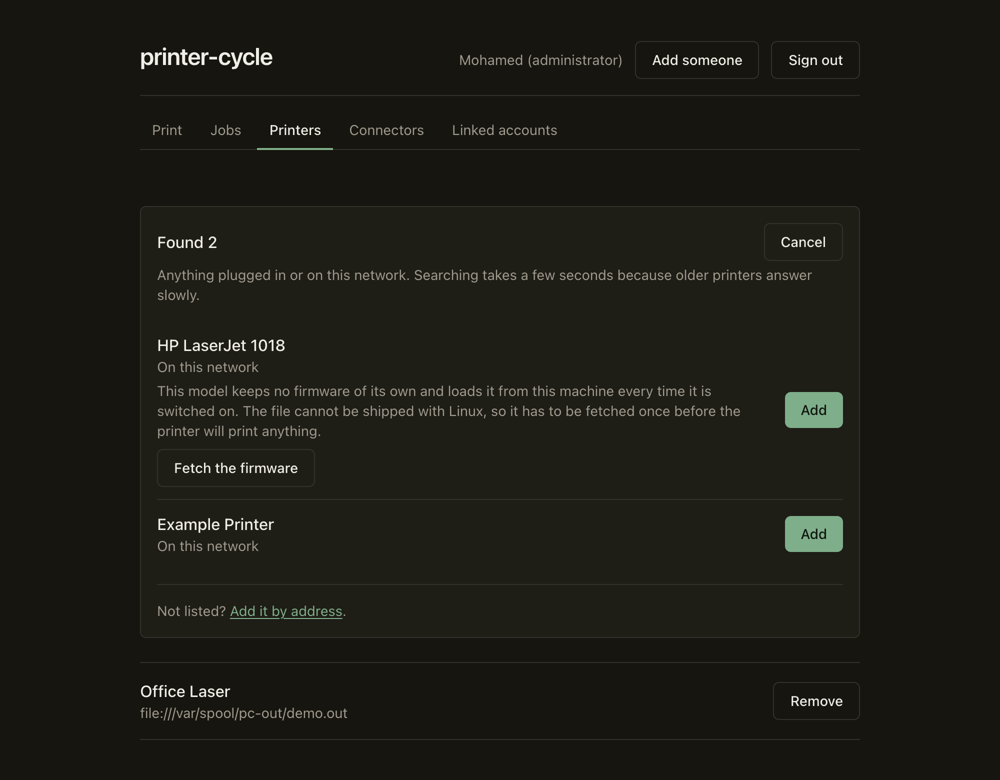
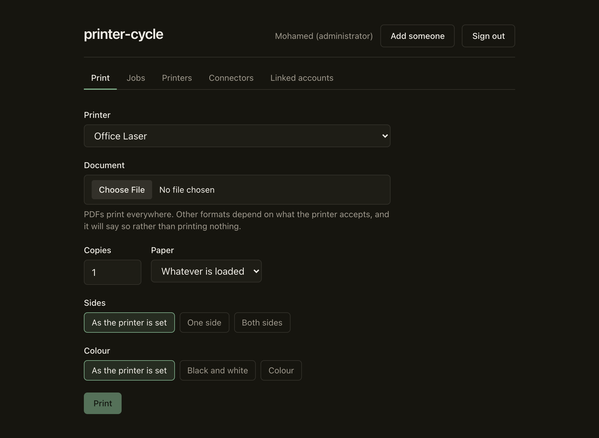
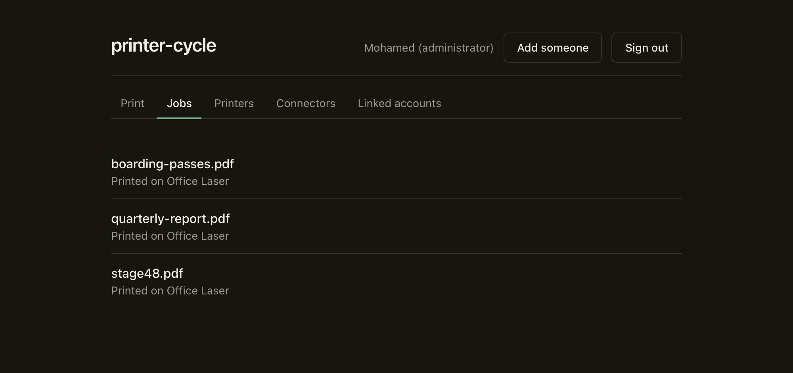

# printer-cycle

A print server for old printers, and for printers whose software is worse than the hardware.

[](https://github.com/mhd64real/printer-cycle/actions/workflows/ci.yml)

## Status

**It works. There is no release yet.**

Discovery, pairing, printing, live job status, users, connectors and the installer are all built and
tested. What is missing is a tagged release with published binaries, and any use on real hardware:
every printer this has ever driven has been a virtual one, and every install has been a container.
That gap is the reason there is no version number.

If you want to run it today, build it and install from the build. See [Installing](#installing).

What works, what needs firmware, and what cannot work on ARM is measured and listed in
[docs/compatibility.md](docs/compatibility.md).

Progress is tracked stage by stage in [PLAN.md](PLAN.md), including everything that turned out to be
wrong along the way.

## What it is

Software you install on a Raspberry Pi or any Linux machine. It takes printers that have become
difficult and makes them ordinary again.

Two problems, both common:

**Your printer works, but nothing can see it.** It predates AirPrint, your phone will not find it,
and the manufacturer stopped shipping drivers three operating systems ago. printer-cycle puts it
back on the network in a form modern devices already understand.

**Your printer works, but its software is miserable.** The vendor app wants an account, a cloud
service, and a large download in order to print one page. printer-cycle gives you a clean dashboard
running on your own hardware instead, with no account, and nothing leaving your network.

## What it looks like

Everything on this network, found and offered in one click. printer-cycle installs every driver up
front, so there is no list of eighteen thousand to search through, and it says plainly when a printer
needs something it cannot supply:



Print from the browser. Options are three-state, so an untouched setting is not sent at all and a
printer configured for double-sided stays that way:



Job status arrives as it happens, pushed rather than polled:



## Installing

There is no release yet, so the one-liner below has nothing to download. It is what will work from
v0.1.0:

```sh
curl -fsSL https://raw.githubusercontent.com/mhd64real/printer-cycle/main/install.sh | sudo sh
```

Today, build it and install from the build:

```sh
git clone https://github.com/mhd64real/printer-cycle
cd printer-cycle
make build-all
sudo sh install.sh --from dist
```

Either way the installer works out what your machine is, installs CUPS and every driver it can, adds
a service account, and sets both binaries to start on boot. Then open `http://<the machine>:6311`.

`--minimal` skips the driver set. `--detect` reports what would happen and changes nothing.
`--uninstall` removes it again, leaving CUPS and your printers alone.

Tested on Debian, Fedora, Arch, Alpine and openSUSE, with the whole install, reinstall and uninstall
cycle run in a container for each, under both systemd and OpenRC.

## How it works

CUPS does the printing. That is deliberate. CUPS and its driver ecosystem represent decades of work
that already solves the genuinely hard part, and reimplementing it would be the quickest way to fail
at this. printer-cycle is the layer above it, and it speaks to CUPS over IPP rather than by driving
command line tools.

The core is small on purpose. It does three things: sign in, add a printer, print.

Everything else is a **connector**: a separate program, in its own repository, written by anyone,
talking to core over a documented socket protocol. AirPrint, Mopria, Samba, a Telegram bot, a mobile
app, all connectors. None of them ship with core, and none of them require a change to core in order
to exist. There are none to install yet: what exists is the protocol, a worked example, and a guide.
Install one and its settings appear in the dashboard on their own.

The dashboard is itself a connector, with no privileged access. Anything it can do, anything you
write can do too.

Why any of this is shaped as it is, including the parts that were wrong first, is in
[docs/architecture.md](docs/architecture.md).

The protocol is specified in [PROTOCOL.md](PROTOCOL.md). If you want to write a connector, start
with [`examples/hello-printer`](examples/hello-printer), which does the whole thing in 95 lines of
dependency-free Node, and then read [docs/writing-a-connector.md](docs/writing-a-connector.md).

It is built to run on a Raspberry Pi Zero 2 W with 512MB of RAM, which means it will run comfortably
on whatever you already have.

## What it is not, and what it cannot do

- **It does not scan.** Scanning is a separate stack entirely and it is out of scope. Not "not yet".
  Out of scope.
- **It is not a cloud service.** No account, no server of ours, nothing phoning home.
- **48 printer models have no driver that runs on ARM.** Their only driver depends on a closed binary
  published for Intel and AMD alone, so on a Raspberry Pi it does not run at all. printer-cycle says
  so rather than failing quietly, and it picks an open driver over a proprietary one whenever there
  is a choice. Those printers work normally on an x86 machine. The list is in
  [docs/compatibility.md](docs/compatibility.md).
- **Nine printer models hold no firmware of their own** and load it from the host every time they are
  switched on, from a file no distribution is allowed to ship. printer-cycle recognises them, says so
  before you pair, and can fetch the file once given a network. Until it does, the printer prints
  nothing and reports no error, which is exactly how those printers look broken when they are not.
- **On Alpine, only printers that need no driver will work.** Alpine packages no printer drivers at
  all, and cannot resolve `.local` names because that needs a glibc component musl does not have. The
  installer says both, out loud, before it starts.
- **It has never met a real printer.** Everything has been verified against virtual printers and
  containers. That is enough to find a great many bugs, and it is not the same as working.

## Development

Go and Docker, nothing else. No printer and no Raspberry Pi required: the development environment
provides a containerised CUPS with the full driver catalogue, virtual queues, and a discoverable
virtual network printer.

```sh
make dev-up && make dev-printers && make build
```

See [docs/development.md](docs/development.md).

## Licence

GPLv3. See [LICENSE](LICENSE).

Connectors are separate programs communicating with core over a documented protocol, not linked
code. Implementing that protocol places no licensing obligation on your connector. License your own
repository however you like, including commercially.

Contributions are accepted under GPLv3 with a sign-off and no contributor licence agreement, which
means core can never be taken proprietary. See [CONTRIBUTING.md](CONTRIBUTING.md).
